###Это файлы с реализацией непрерывной ФС
###Работает на 20-м стандарте с++

### функции
1) **exit** - 
Данная функция позволяет выйти из главного цикла и завершить работу с программой `exit`
2) **mkdir** -
Создает в текущей директории каталог с именем которое необходимо передать [обращаем внимание на то, что пробелы в имени недопустимы!] `mkdir dirname`

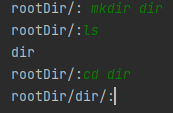

3)**touch** - 
Создает в текущей директории файл с именем и весом, которые мы передаем заранее [обращаем внимание на то, что пробелы в имени недопустимы!] `touch fileName 5`

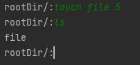

4) **open** - 
Отрывает файл (переносит его содержимое в RAM), если файл executable `open file`

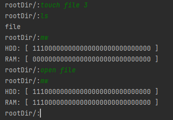

5) **close** - 
Закрывает файл (вычищает его из RAM) `close file`

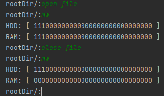

6) **cd** - 
Позволяет перейти в следующий каталог `cd nextDir` или опуститься на уровень ниже `cd ..` 

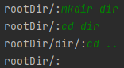

7) **ls** - 
Выводит содержимое каталога `ls`

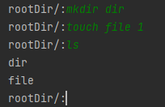

8) **copy** - 
копирует файл\директорию `copy something`

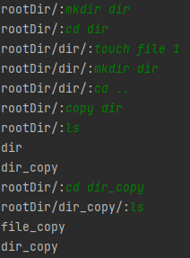

9) **touchweak** - 
создает символическую ссылку на файл `touchweak ptr parent` ptr - имя ссылки, parent - куда смотрит ссылка, при действии open открывает родительский файл

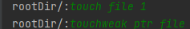

10) **rm** - 
удаляет содержимое каталога по имени `rm file`

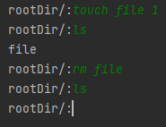

11) **mw** - 
выводит табличку 2*30 показывая заполнение HDD и RAM `mw`

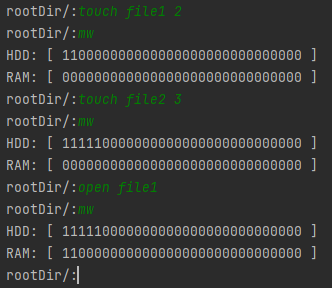

12) **find** - 
выводит содержимое каталога по совпадению `find fi` , `find *.txt`

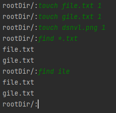

13) **chmod** - 
меняет параметр executable выбранного файла `chmod file`

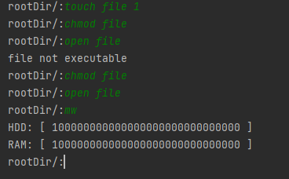
